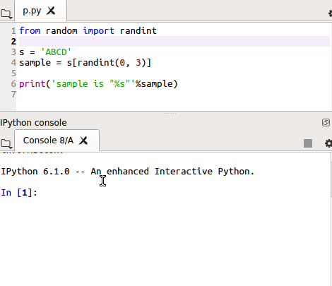

<h1 align="center">Box-X</h1>

  <strong>:high_brightness:Hack Python and Vision:crescent_moon:</strong>

  A Tool-box for Efficient Build and Debug in Python. Especially for <strong>Scientific Computing</strong> and <strong>Computer Vision</strong>.

 

  

  <!-- Build Status -->
  
  
  <!-- pyversions -->
  
  <!-- platform -->
  
  <!-- License -->
  
  <!-- Version -->
  
  <!-- Binder -->
  
  <!--  -->
  

  Code with ❤︎ by
  <a href="https://github.com/DIYer22">DIYer22</a> and
  <a href="https://github.com/DIYer22/boxx/graphs/contributors">
    contributors
  </a>
  

 

---

## Examples

All Tools are divided into 2 parts by wether the tool is general:    
 * Left Part: [**General Python Tool**](#1.-General-Python-Tool). The tools could be used anywhere in Python

 * Right Part: [**Scientific Computing and Computer Vision Tool**](#2.-Scientific-Computing-and-Computer-Vision-Tool). Those tools are useful in Scientific Computing and Computer Vision field

*P.S. click the GIF picture to see more clearer GIF*

<table  style="">
  <tr>
    <td valign="top" width="50%">
    
  ### General Python Tool 
  

        
  #### ▶ Use `p/x` instead of `print(x)`   
  `p/x` will `print(x)` and return `x`
  
  💡 **Note:** `p/x` is easy to print value in expression.
        

          
          
        
  #### ▶ Use `g.name = x` or `g.name/x` to transport var to Python interactive console
     
  💡 **Note:** `gg` is same usage as `g`, but `gg` will pretty print all vars in `locals()`. 
        

          
          
        
  #### ▶ `g()` to transport all vars that in the function to Python interactive console
  
  💡 **Note:** `g()` is a useful tool for debug. `import boxx.g` is convenient way to use `g()` instead of `from boxx import g;g()`(`import boxx.gg` is avaliable too)
        

          
          
    </td>
    <td valign="top">
    
  ### Scientific Computing and Computer Vision

  Useful tools in **Scientific Computing** and **Computer Vision** field. All tools support array-like types, include `numpy`, `torch.tensor`, `mxnet.ndarray`, `PIL.Image` .etc 
        

          
          

  #### ▶ `loga` to visualization matrix and tensor   
  `loga` will show many attributes of array-like object.
  
        

          
          

  #### ▶ `show` every image in complex struct
  `show` could find every image in complex struct and imshow they.
  
  💡 **Note:** if args inculde funcation. those funcations will process all numpys befor imshow.
        

          
          

  #### ▶ `tree` for visualization complex struct
  like `tree` command in shell that could visualization any struct in tree struct view.
  
  💡 **Note:** `tree` support types include `list`, `tuple`, `dict`, `numpy`, `torch.tensor/Dataset/DataLoader`， `mxnet.ndarray`, `PIL.Image`.etc
        

          
          
    </td>
  </tr>
</table> 

---

## Box-X Tutorial

[**Tutorial for computer device**](https://mybinder.org/v2/gh/DIYer22/boxx/master?filepath=tutorial_for_boxx.ipynb): We use [Binder](https://mybinder.org) to run this Tutorial in an executable environment. That's mean you can **run tutorial cells rightnow** in your browser without download repository.

[**Tutorial for mobile device**](https://nbviewer.jupyter.org/github/DIYer22/boxx/blob/master/tutorial_for_boxx.ipynb): Just view the Tutorial.

## Acknowledgments
 * `boox.x_` is supported by [Fn.py: enjoy FP in Python](https://github.com/kachayev/fn.py)
 * `performance` is supported by [SnakeViz](https://jiffyclub.github.io/snakeviz/)
 * `heatmap` is supported by [csurfer/pyheat](https://github.com/csurfer/pyheat)
 * I develop **`boxx`** in [Spyder IDE](https://github.com/spyder-ide/spyder), [Spyder](https://github.com/spyder-ide/spyder) is a awesome Scientific Python Development Environment with Powerful [**Qt-IPython**](https://github.com/jupyter/qtconsole)

