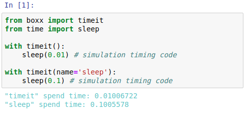
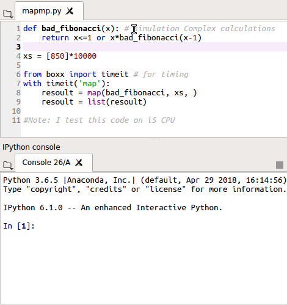
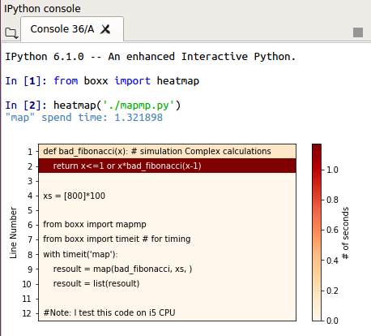

**Language :** [](https://github.com/DIYer22/boxx) [](./README_zh_cn.md)
  
<br>
<h1 align="center">Box-X</h1>


<div align="center">
  <strong>Hack Python and Vision</strong>
</div>

<div align="center">
  <strong><code>Box-X</code></strong> 是一个旨在提高 Python 代码开发和调试效率的工具库，尤其是在  <strong>科学计算</strong> 和 <strong>计算机视觉</strong> 领域.
</div>

<br/>

<div align="center">
  <!-- Build Status -->
  <a href="https://travis-ci.org/DIYer22/boxx">
    
  </a>
  
  <!-- pyversions -->
  <a href="https://pypi.python.org/pypi/boxx">
    
  </a>
  <!-- platform -->
  <a href="">
    
  </a>
  <!-- License -->
  <!--<a href="https://www.github.com/DIYer22/boxx">
    
  </a>-->
  <!-- Version -->
  <a href="https://pypi.python.org/pypi/boxx">
    
  </a>
  <!-- Binder -->
  <a href="https://mybinder.org/v2/gh/DIYer22/boxx/master?filepath=tutorial_for_boxx.ipynb">
    
  </a>
</div>


<div align="center">

 ### [简介](#一-简介) | [安装](#二-安装) | [示例](#三-示例) | [教程](#四-教程) | [致谢](#五-致谢)
</div>


<div align="center">
  <sub>Code with <span style="color:red">❤︎</span> by
  <a href="https://github.com/DIYer22">DIYer22</a> and
  <a href="https://github.com/DIYer22/boxx/graphs/contributors">
    contributors
  </a>
  </sub>
</div>

<br/>


---
## 一. 简介

**`Box-X`** 的目标是提高 Python 代码的开发和调试效率.    

特别是在 **科学计算** 和 **计算机视觉** 领域有着良好的支持. 

因此，工具库的所有功能 会根据该功能是否通用 而被分为了两个部分:    
 * **通用功能**: 这些功能（工具）可以在任何 Python 开发中发挥作用

 * **科学计算和计算机视觉功能**: 这些功能（工具）主要用于科学计算和计算机视觉领域
 

P.S. **`boxx`** 同时支持 **`Python 2/3`** 及 **`Linux | macOS | Windows`** 操作系统.

<!--如果你从事科学计算和计算机视觉，这里有一个详尽的中文介绍：

[ 开发, 调试计算机视觉代码有哪些技巧？]()-->

## 二. 安装
#### 源码安装
```bash
git clone https://github.com/DIYer22/boxx
cd boxx/
python setup.py install
```
💡 **Note:** 由于国内的 `pip` 镜像平均有好几天的延迟，强烈推荐从 GitHub 安装.

#### Linux or macOS
```
pip install git+https://github.com/DIYer22/boxx
```

#### Windows
```
pip install boxx -U
```


💡 **Note:** 确保 `pip` 镜像的 `boxx` 版本大于 `0.9`，否则建议源码安装。


## 三. 示例

示例也被分为了两个部分

左侧为 **通用功能**，右侧为 **科学计算和计算机视觉功能**。

💡 **Note:** *点击图片会放大图片，如果是 GIF，GIF还会从头开始播放*

<table  style="">
  <tr>
    <td valign="top" width="50%">
    
  ### 通用功能
  <hr></hr>
        
  #### ▶  `p/x` 是更方便 `print(x)` 的方式   
  `p/x` 在执行 `print(x)` 后会返回 `x`
  [](./other/img/p.png)     
  💡 **Note:** `p/x` 能够方便的打印表达式中的值.
        <hr></hr>
        <br><br>
        <br><br>
        
  #### ▶  `g.name = x` 和 `g.name/x` 可以把函数内的变量传送到 Python interactive console 中
  [ ](./other/gif/g.gif)    
  💡 **Note:** 
  * `gg` 和 `g` 的用法一样, 但 `gg` 会在传输的同时 打印出变量. 
  * 如果之前在 console 中存在该变量名称，则变量的值将被新值覆盖.
        <hr></hr>
        <br><br>
        <br><br>
        
  #### ▶ `g()` 一次性传输函数内的所有变量到 Python interactive console 中
  [ ](./other/gif/g_call.gif)    
  💡 **Note:** `g()` 在 Debug 时非常有用. `import boxx.g` 是 `g()` 的便携版本，避免了 `from boxx import g;g()`(`import boxx.gg` 同理)
        <hr></hr>
        <br><br>
        <br><br>
        
  #### ▶ `wp`, `wg`, `wgg` 分别是 `p`, `g`, `gg` 的多变量版本，只需把变量放入 `with` 结构中即可
  `wp`, `wg`, `wgg` 的意思分别是 "With Print", "With to Global", "With log and to Global"
  [ ](./other/gif/w.gif)    
  💡 **Note:** 
  * `wp`, `wg`, `wgg` 只作用于在 `with` 结构中进行赋值操作的变量. 
  * 如果变量名之前存在于 `locals()` 同时 `id(变量)` 没有变化 , `with` 结构可能无法检测到该变量 
        <hr></hr>
        <br><br>
        <br><br>
        
        
    </td>
    <td valign="top">
    
  ### 科学计算和计算机视觉功能

  本部分通过用例来介绍几个在 **科学计算** 和 **计算机视觉** 领域内的一些实用工具 . 几乎所有的工具(函数) 都支持 `numpy`, `torch.tensor`, `mxnet.ndarray`, `PIL.Image` 等类似多维数组的数据类型
  💡 **Note:** 若你是通过 `ssh` 在远程服务器上执行代码， 建议 `ssh` 加上 `-X` 使得 `plt` 可视化的图表能传输到本地显示，即 `ssh -X user@host`。
        <hr></hr>
        <br><br>
        <br><br>

  #### ▶ 用 `loga` 来可视化多维数组   
  `loga` 是 "log array" 的意思, `loga` 能展示多维数组的许多属性.
  [](./other/gif/loga.gif)     
  💡 **Note:** `loga` 支持 `numpy`, `torch.tensor`, `mxnet.ndarray`, `PIL.Image` .etc 
        <hr></hr>
        <br><br>
        <br><br>

  #### ▶ 用 `show` 来方便地可视化图像，哪怕图像隐藏于复杂的结构中
  `show` 能够从复杂结构中找出所有类型的图像 并可视化他们。它甚至支持从 torch 的 Dataloader 中展示一个 batch 的图像
  [](./other/gif/show.gif)    
  💡 **Note:** 如果有函数作为 `show` 的参数(比如 `torgb`)，则会对所有 `numpy` 执行此函数后再可视化。
        <hr></hr>
        <br><br>
        <br><br>

  #### ▶ 使用 `tree` 来可视化复杂结构
  如同 shell 中的 `tree` 命令， `boxx.tree` 可以以树的形式来解构和展示任何复杂结构.
  [](./other/gif/tree.gif)    
  💡 **Note:** `tree` 支持的数据有 `list`, `tuple`, `dict`, `numpy`, `torch.tensor/Dataset/DataLoader`, `mxnet.ndarray`, `PIL.Image`.etc
        <hr></hr>
        <br><br>
        <br><br>
    </td>
  </tr>
</table> 


<table  style="">
  <tr>
    <td valign="top" width="50%">
    
  #### ▶ `boxx` 调试工具矩阵
| 变量个数 \ 操作 | print | transport | print & transport |
| :---- | :---- | :---- | :---- |
| 单变量 | `p/x` | `g.name/x` | `gg.name/x`|
| 多变量 | `with wp:` | `with wg:` | `with wgg:` |
| `locals()`| `p()` | `g()` | `gg()` |
| `locals()`\_2 | `import boxx.p` | `import boxx.g` | `import boxx.gg` |    

  💡 **Note:**   
  * **transport** 的意思是把函数内的变量传送到 Python interactive console 中
  * **`locals()`** 指作用于函数内的所用变量
  * **`locals()`\_2**: 当 `boxx` 未导入时， `import boxx.{操作}` 能更方便的执行 `{操作}()`
        <br><br>
        <hr></hr>
        
  ####  ▶ 使用 `what` 来了解任何对象"
  [ ](./other/img/what.png)    
  💡 **Note:** `what(x)` 通过打印 `x` 的 **文档**, **父类继承关系**, **内部结构** 及 **所有属性** 来全面了解 `x`. 是 `help(x)` 的补充.
        <br><br>
        <hr></hr>
        
  #### ▶ `timeit` 是一个方便的计时工具
  [ ](./other/img/timeit.png)    
  💡 **Note:** `timeit` 会对在 `with` 结构下的代码块进行计时，并用蓝色来打印出运行的时间.
        <br><br>
        <hr></hr>
        
  #### ▶ `mapmp` 是多进程版本的 `map`
  `mapmp` 的意思是 "MAP for Multi Process", 和 `map` 有着一样的用法，但会用多进程加速.    
  [ ](./other/gif/mapmp.gif)    
  💡 **Note:** 
  * 在 Python 中，多进程最好在 `if __name__ == '__main__':` 中运行.
  * `mapmp` 的 **pool** 参数来控制进程数目，默认为 CPU 线程数目.
  * 在多进程程序中, 打印进度往往非常麻烦. **printfreq** 参数会解决这个问题.
  * 如同 `map` 一样，`mapmp` 支持多个参数输入函数 `mapmp(add, list_1, list_2)`
        <br><br>
        <hr></hr>
        
  #### ▶ 用 `heatmap` 来展示代码的运行时间热力图
  [ ](./other/img/heatmap.png)    
  💡 **Note:** `heatmap` 也支持字符串形式的 Python 代码.
        <br><br>
        <hr></hr>
        
  #### ▶ `performance` 可以统计函数调用并可视化代码性能
  [ ](./other/gif/performance.gif)    
  💡 **Note:** `performance` 也支持字符串形式的 Python 代码.
    </td>
  </tr>
</table>

---

## 四. 教程

**`boxx`** 的教程是一个 Jupyter Notebook 文件，可以边看边运行.

有三种方式来查看/运行此教程

#### 方式一：可执行的在线 Notebook: 
Notebook 文件被运行在 [Binder](https://mybinder.org) 上。[Binder](https://mybinder.org) 提供了可执行、可交互的在线 Notebook 环境.    
也就是说，无需下载和运行任何代码，只需浏览器打开链接，就可以执行任何 Notebook 中的代码块。  
* [**=> 可直接执行的在线教程**](https://mybinder.org/v2/gh/DIYer22/boxx/master?filepath=tutorial_for_boxx.ipynb)

#### 方式二：下载并在本地打开教程:

```bash
git clone https://github.com/DIYer22/boxx
cd boxx/
python setup.py install
jupyter notebook
```
在 Jupyter Notebook 中打开 `./tutorial_for_boxx.ipynb` 即可.

#### 方式三：静态的 Notebook:
 只能看 不能交互的 Notebook.
* [**=> 静态的 Tutorial**](https://nbviewer.jupyter.org/github/DIYer22/boxx/blob/master/tutorial_for_boxx.ipynb)


## 五. 致谢
 * 特别感谢徐晓栋、吴国栋、范浩强和熊鹏飞对 `boxx` 提出的建议
 * I develop **`boxx`** in [Spyder IDE](https://github.com/spyder-ide/spyder), [Spyder](https://github.com/spyder-ide/spyder) is a awesome Scientific Python Development Environment with Powerful [**Qt-IPython**](https://github.com/jupyter/qtconsole)
 * `performance` is supported by [SnakeViz](https://jiffyclub.github.io/snakeviz/)
 * `heatmap` is supported by [csurfer/pyheat](https://github.com/csurfer/pyheat)
 * `boox.x_` is supported by [Fn.py: enjoy FP in Python](https://github.com/kachayev/fn.py)


